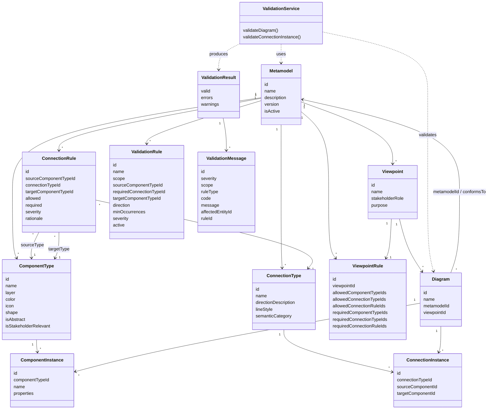

# Metamodel Class Model

Das verfeinerte Metamodell ist klassendiagrammaehnlich aufgebaut. `ConnectionRule` bleibt die fachliche Quelle fuer erlaubte Verbindungen. `ViewpointRule` trennt Sichtregeln von der Viewpoint-Beschreibung. `ValidationRule` prueft Mindestqualitaet in konkreten Diagrammen.

`ValidationResult` wird nicht persistiert und ist kein dauerhaftes Bestandteilobjekt eines Diagramms. Es wird von der Validierungslogik fuer einen konkreten Lauf erzeugt.

Die Mermaid-Quelle fuer das praesentationsfaehige Klassendiagramm liegt zusaetzlich unter [docs/diagrams/metamodel-class-diagram.mmd](./diagrams/metamodel-class-diagram.mmd). Der Diagrammindex steht in [docs/diagrams/README.md](./diagrams/README.md).

## Klassen

- `Metamodel`: logische Root-Struktur fuer das aktive Kundenregelwerk.
- `ComponentType`: erlaubte Bausteinart, zum Beispiel Stakeholder, Application oder Business Capability.
- `ConnectionType`: semantische Art einer Beziehung, zum Beispiel `serves` oder `responsible_for`.
- `ConnectionRule`: konkrete Erlaubnisregel: Source Type + Connection Type + Target Type.
- `Viewpoint`: beschreibt Rolle, Zweck und Sichtnamen.
- `ViewpointRule`: beschreibt, welche Typen und Regeln in einer Sicht erlaubt oder verpflichtend sind. Die alten Listenfelder am `Viewpoint` bleiben Legacy.
- `ValidationRule`: prueft Mindestbeziehungen und Qualitaetsbedingungen, zum Beispiel Application braucht eine verantwortliche Stakeholder-Beziehung.
- `Diagram`: konkrete Modellierungssicht mit optionalem `viewpointId` und `metamodelId`.
- `ValidationResult`: strukturierte Rueckgabe eines Validierungslaufs, nicht persistierter Diagrammzustand.

## JSON-Konfiguration

Das fachliche Metamodell kann als eine einzelne JSON-Datei exportiert und importiert werden. Die Datei bildet genau die Root-Struktur `Metamodel` plus `ComponentType`, `ConnectionType`, `ConnectionRule`, `Viewpoint`, `ViewpointRule` und `ValidationRule` ab. Konkrete `Diagram`, `ComponentInstance` und `ConnectionInstance` werden dabei bewusst nicht exportiert.

Formatdetails stehen in [METAMODEL_JSON_FORMAT.md](./METAMODEL_JSON_FORMAT.md). Die Default-EAM-Definition liegt unter `backend/src/data/default-metamodel.json`.

## Regelarten

- `ConnectionRule`: Was ist grundsaetzlich im Metamodel erlaubt?
- `ViewpointRule`: Was ist in einer Stakeholder-Sicht erlaubt oder verpflichtend?
- `ValidationRule`: Welche Mindestqualitaet muss ein konkretes Diagramm erreichen?

## MVP-Grenzen

- Kein grafischer UML-Editor fuer das Metamodell.
- Keine zusammengesetzten OR-/AND-Regeln fuer ValidationRules.
- Keine Vererbungshierarchie zwischen Component Types.
- Keine Versionierungshistorie je Regel.
